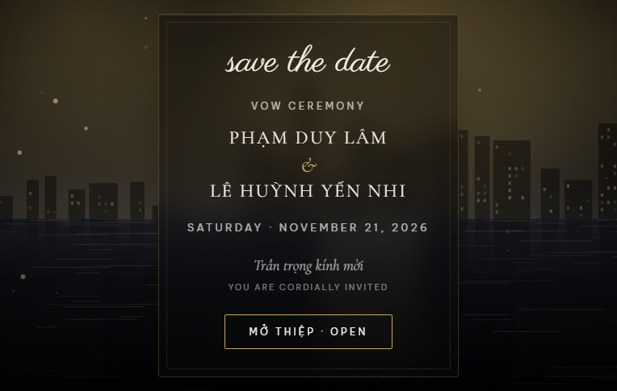
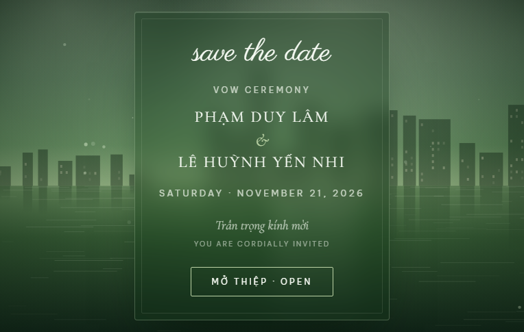
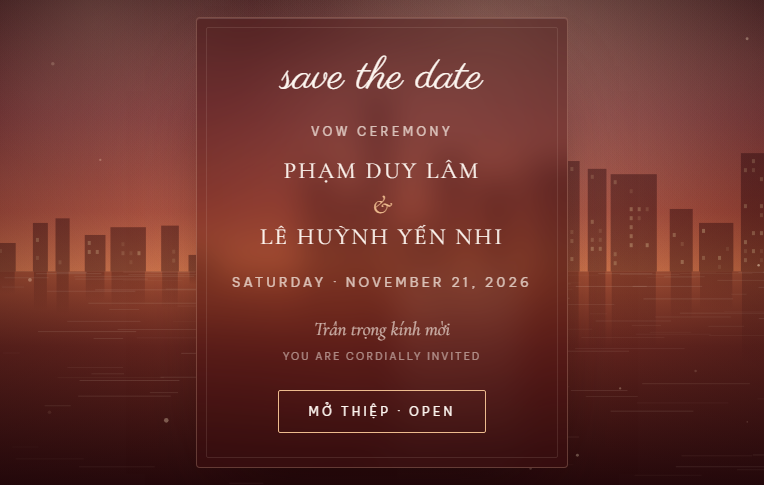
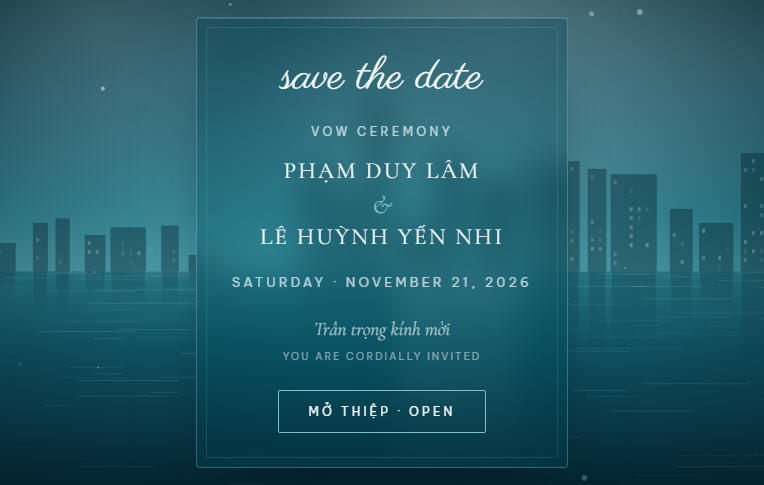
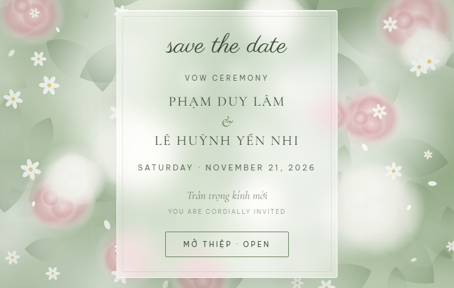
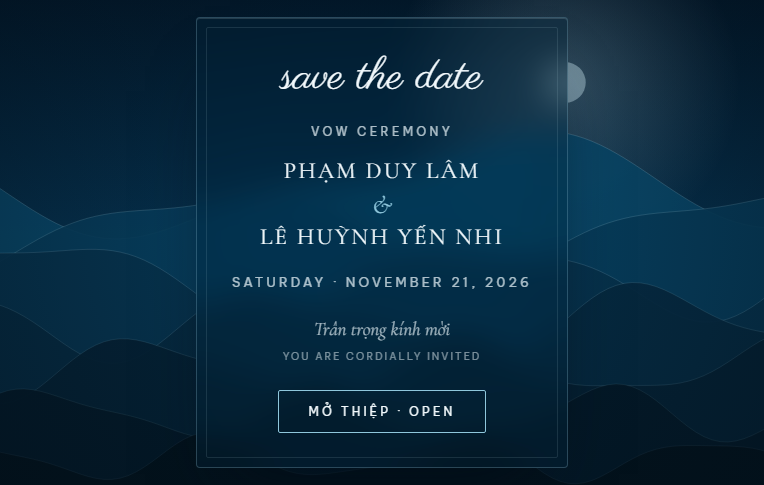
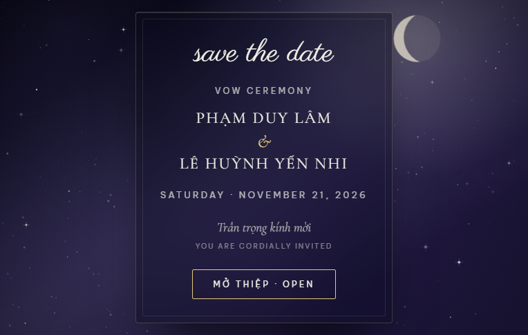
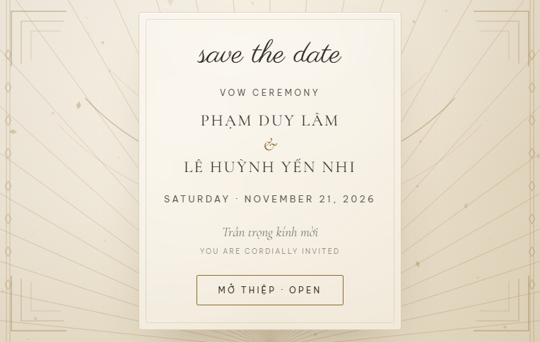

# Thiệp cưới online — Vow Ceremony

**Phạm Duy Lâm & Lê Huỳnh Yến Nhi**
Thứ Bảy, 21 tháng 11 năm 2026 · 17:00
Sundeck Saigon Princess — Saigon Port, 05 Nguyễn Tất Thành, P. Xóm Chiếu, TP. Hồ Chí Minh

Thiệp mời dạng web, song ngữ Anh – Việt. Mỗi file là một bản hoàn chỉnh, chỉ khác tông màu và cảnh nền.

---

## 8 phiên bản

<table>
<tr>
<td width="50%"><br><b>index.html</b> — Đen &amp; vàng kim · sông Sài Gòn<br><i>Bản chính thức</i></td>
<td width="50%"><br><b>thiep-xanh-la.html</b> — Xanh lá · sông Sài Gòn</td>
</tr>
<tr>
<td><br><b>thiep-do.html</b> — Đỏ hoàng hôn · sông Sài Gòn</td>
<td><br><b>thiep-teal.html</b> — Teal · sông Sài Gòn<br><i>Tông theo đúng thiệp giấy</i></td>
</tr>
<tr>
<td><br><b>thiep-hoa.html</b> — Nền sáng · vườn hoa màu nước</td>
<td><br><b>thiep-song.html</b> — Navy · sóng biển chuyển động</td>
</tr>
<tr>
<td><br><b>thiep-sao.html</b> — Tím đêm · trời đầy sao</td>
<td><br><b>thiep-deco.html</b> — Kem &amp; vàng đồng · art deco</td>
</tr>
</table>

Ảnh trong `preview/` chỉ để xem trước, **thiệp không dùng đến chúng**.

---

## Nội dung thiệp

Bìa mở thiệp → tên cô dâu chú rể → dải lịch tháng 11 (ngày 21 đóng dấu tim *limited edition*)
→ giờ &amp; địa điểm + nút chỉ đường → đếm ngược + thêm vào lịch → dress code
→ lịch trình 4 chặng → xác nhận tham dự → sổ lưu bút → lời cảm ơn.

**Lịch trình buổi lễ**

| Giờ | Nội dung |
|---|---|
| 17:00 | Welcome drink — đón khách, nước chào mừng |
| 17:30 | Vow Ceremony — trao lời thề và nhẫn cưới |
| 18:00 | Tự do chụp ảnh, nghỉ ngơi |
| **19:00** | **Toàn bộ khách quay lại tàu lúc 19:10** |
| 19:20 | Tàu khởi hành ngắm cảnh đêm, dùng bữa cùng nhạc sống |
| 21:30 | Cập bến, tiễn khách |

---

## Dùng thế nào

1. Mở thử cả 8 file bằng trình duyệt, chọn một tông.
2. Đổi tên file đó thành `index.html` (ghi đè bản đen & vàng kim), xoá các file còn lại.
3. Gửi link cho khách.

---

## Sửa nội dung

Phần chữ, mục, bố cục dùng chung nằm trong **`_source.html`**. Bảng màu và code vẽ nền nằm trong **`build.js`**.

Sửa `_source.html` rồi chạy:

```bash
node build.js
```

Cả 8 file sinh lại cùng lúc, không lo lệch nhau. Cần Node.js, không cần cài thêm gói nào.

Chụp lại ảnh xem trước (cần Chrome):

```bash
for f in index thiep-teal thiep-xanh-la thiep-do thiep-hoa thiep-song thiep-sao thiep-deco; do
  chrome --headless=new --disable-gpu --hide-scrollbars --virtual-time-budget=4500 \
         --screenshot="preview/$f.png" "file://$PWD/$f.html"
done
```

---

## Còn phải điền

Mở file thiệp, tìm khối `var CFG = {` ở gần cuối:

```js
rsvpForm:    "",           // ← link Google Form "Danh sách khách mời tham dự Vow"
deadline:    "01.11.2026", // hạn phản hồi — nên hỏi bên tàu chốt sổ trước bao nhiêu ngày
contactName: "",           // vd: "Duy Lâm"
contactTel:  ""            // vd: "0901234567" — điền cả hai thì hiện dòng liên hệ dự phòng
```

Chưa gắn `rsvpForm` thì nút "Xác nhận tham dự" sẽ hiện thông báo nhắc thay vì mở form.

**Google Form nên có các cột:** họ tên · có/không tham dự · tổng số người · số điện thoại hoặc Zalo · có trẻ em không (mấy bé, bao nhiêu tuổi) · nhu cầu ăn uống đặc biệt · cần hướng dẫn đường vào bến tàu không · lời nhắn.

Trong phần cài đặt Form nhớ **tắt** "Giới hạn 1 phản hồi" và **không** bắt xác minh email — nếu bật, khách không có Gmail sẽ bị chặn ngay ở bước đăng nhập.

---

## Ghi chú kỹ thuật

- **Không có file ảnh nào.** Toàn bộ nền được vẽ bằng Canvas 2D lúc trang chạy. Mỗi file `.html` tự chứa đủ HTML, CSS và JavaScript.
- Thứ duy nhất tải từ ngoài là **font Google** (Cormorant Garamond, Be Vietnam Pro, Parisienne). Không có mạng thì chữ lùi về font hệ thống, bố cục vẫn nguyên.
- Ngày giờ được neo cứng theo **giờ Việt Nam (UTC+7)**, nên khách ở múi giờ khác vẫn thấy đúng đếm ngược và đúng sự kiện khi bấm "Thêm vào lịch".
- Sổ lưu bút lưu bằng `localStorage` — lời chúc chỉ hiện trên máy người viết, không gửi về đâu cả. Muốn thu thập thật thì dùng Google Form.
- Có tôn trọng `prefers-reduced-motion`: ai bật chế độ giảm chuyển động thì nền đứng yên.

---

## Đưa lên GitHub Pages

```bash
git add .
git commit -m "Thiệp cưới Duy Lâm & Yến Nhi"
git push
```

Vào **Settings → Pages**, chọn nhánh và thư mục gốc. Vài phút sau link có dạng
`https://<tên-tài-khoản>.github.io/<tên-repo>/`.

Lưu ý: GitHub Pages là **công khai**, ai có link đều xem được và công cụ tìm kiếm có thể lập chỉ mục.
Nếu không muốn bị tìm thấy qua Google, thêm dòng này vào `<head>` của file thiệp:

```html
<meta name="robots" content="noindex, nofollow">
```
